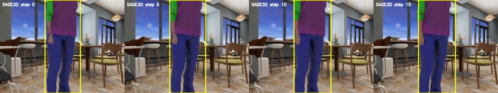

# Example datasets

This directory contains a tiny, self-contained excerpt of each authoritative dataset so collaborators can inspect real directory layouts, pixels, depth encoding, metadata, and label shapes directly on GitHub. Each excerpt has 16 consecutive frames; the complete published sample is 5,854,999 bytes across 99 files and does not require Git LFS.

These files are examples, not a training or evaluation split. Read [`DATA_NOTICE.md`](DATA_NOTICE.md) before redistributing or reusing them. Natural-language fields and per-frame labels are metadata/ground truth and must not enter OmTrackVLA model inputs.

## Quick visual preview

InternData-N1 (RGB; the matching 16-bit depth frames are also included):


SAGE3D extracted (yellow boxes visualize ground-truth labels only):



TpT clean v2 (yellow boxes visualize ground-truth labels only):


## Published subset

```text
samples/
  subset_manifest.json
  checksums.sha256
  previews/
    intern_data_n1.jpg
    sage3d_extracted.jpg
    tpt_bench_clean_v2.jpg
  intern_data_n1/<group>/<scene>/
    meta/{info.json,info.source.json,episodes.jsonl,episodes_stats.jsonl}
    data/chunk-000/episode_000000.parquet
    videos/chunk-000/
      observation.images.rgb/*.jpg
      observation.images.depth/*.png
  sage3d_extracted/<run>/<mode>/<episode>/<camera>/
    {derived.json,0.json,0_info.json,camera_info.json,quality.json,_ACCEPTED}
    rgb/*.jpg
    depth/*.png
  tpt_bench_clean_v2/<sequence>/
    {frames.parquet,meta.json,desc.txt}
    rgb_frames/*.jpg
```

`subset_manifest.json` records the exact source episode and frame indices. `checksums.sha256` covers the other 98 files. The sample deliberately excludes absolute symbolic links, videos, point clouds, target crops/references, caches, and every non-selected frame.

Verify a checkout with:

```bash
cd example_datasets/samples
sha256sum -c checksums.sha256
```

## Authoritative source layouts

The full datasets remain external to Git:

- InternData-N1: `/h100-2/vln_n1/traj_data`
- SAGE3D extracted: `/data/nfs/share/OmTrackVLA/data/sage3d_extracted`
- TpT clean v2: `/data/nfs/share/OmTrackVLA/data/tpt_bench_clean_v2`

Their complete schema, counts, quality rules, split units, and prohibited model-input fields are documented in [`docs/data_inventory.md`](../docs/data_inventory.md). Do not train against this convenience sample; use the authoritative roots through the versioned data manifest.

## Reproduce the export on `g0014`

From the repository root:

```bash
PY=/data/nfs/share/gzy/miniconda3/envs/omtrackvla/bin/python
$PY scripts/export_example_datasets.py \
  --output /data/nfs/share/wam_tracking/OmTrackVLA/example_datasets/samples
```

The exporter refuses to overwrite an existing output and refuses any destination inside a source dataset root. Remove or rename the existing sample explicitly before reproducing it.

`view_inventory.json` retains the audit of the former 1.80 GB cluster-local symlink view and explains why it was not copied verbatim.
